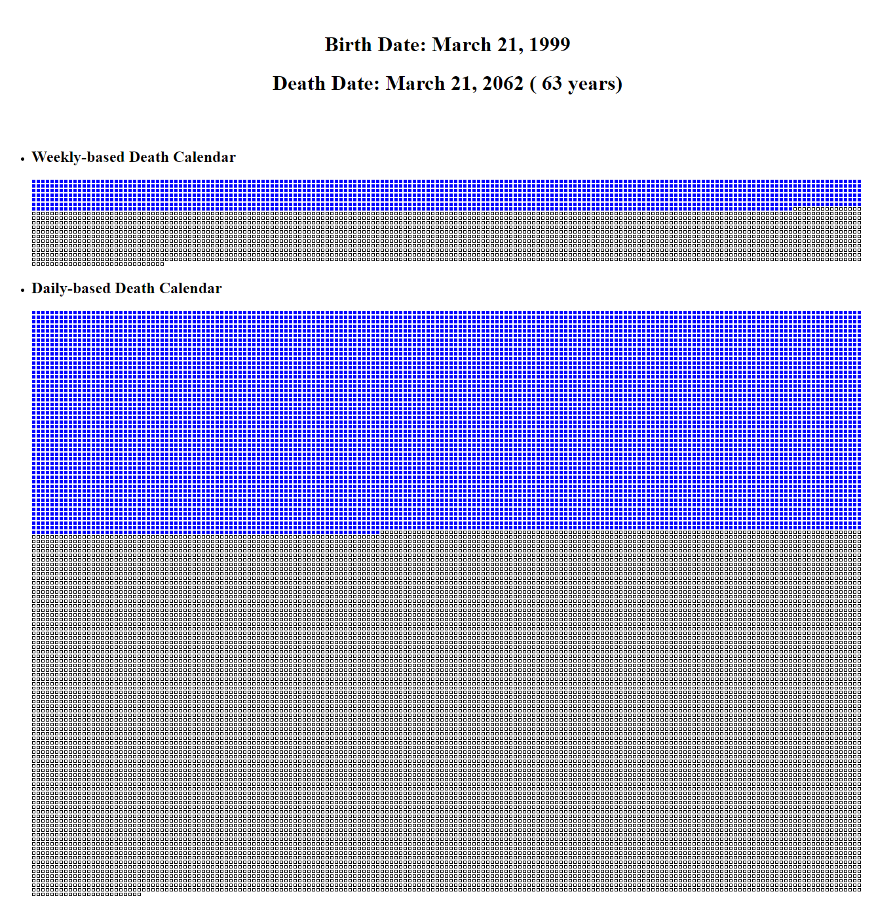

# Life Calendar
Very simple python project that visualize our life progress and the distance to our eventual death. Consist of daily-based &amp; weekly-based calender. Build using Flask &amp; Datetime (built-in library). This can be used for "Memento Mori" (Remember that we all will die)

## Screenshoots


## Installation
Install Flask by using this command :

```
pip install Flask==2.0.3
```

Or by installing requirements.txt

```
pip install -r requirements.txt
```

## Usage
Run the flask app by executing this command :
```
python app.py
```
Or :

```
flask run
```
